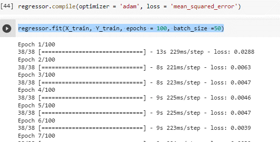

## Introduction

Our endeavour is to help a cryptocurrency investor make an investment on a coin that will fetch him the best returns in the time duration he desires. The model will help the investor make the right decision in terms of which asset he must purchase ( Purchase currency like Bitcoin, Ethereum etc) and how much return he can expect over a period of time by comparing the growths or downfalls of various crypto currencies.
We extrapolate these results based on real time and historical data that has been fetched from :  https://finance.yahoo.com/quote/BTC-USD/

## Recurrent Neural Networks

A traditional Neural network will not be able to make decisions that depend on the previous outputs accurately. This is solved by Recurrent Neural Networks where we pass the output from previous computation back into the layer again. It uses a single activation layer and can be used for translation, forecasting, speech recognition.

## DRAWBACKS OF RNN

Despite RNN having feedback loops that help it maintain a memory over time, its memory capacity is not enough to accurately handle long term temporal dependencies. This is because the gradient of loss function decays exponentially with time.
Example. If i had to predict the next word in the line “ the clouds are in the “ the next word would be sky. 
If i had to add more context to it, like “I grew up in France… I speak fluent” , i want the word French, it might give another language. If the gap for the context is small RNN works else it doesn't perform well.
To resolve this issue we use Long Short term Memory

## Long Short Term Memory

Long Short term Memory is a special type of RNN where there is a presence of an additional memory unit that can maintain memory over a long period of time. Instead of having just a Single Neural Network it has 4.
LSTM deal with the vanishing gradient issue through input and forget gates, which aid in better control over the gradient flow and aid in preservation of long range dependence.

## IMPLEMENTATION

### STEP ONE : Importing the dataset and preprocessing

Data source : https://finance.yahoo.com/quote/BTC-USD/
Fetching the data:
data = pd.read_csv('BTC-USD.csv', date_parser = True)
data.tail()

### STEP 2: splitting the test and train data

### Step 3: applying LSTM
Here tanh and sigmoid activation function is used

### Step 4:Fitting the model:
regressor.fit(X_train, Y_train, epochs = 100, batch_size =50)

## Visualizing output

## Future work

## Just predicting the crypto value will not be of much use to the customer hence we will implement a function to find the return for X years from now for a specific crypto currency. 

So here we create a return function when it will subtract the predicted value – the value of bitcoin when he invested. This will return his total profit.

## The code here is just for the BTC, we will extend this code to other cryptocurrencies as well, like eth,doge,lite etc.

As this is a standard template we can just change the dataset by downloading the details of eth, doge, lite etc from yahoo finance site.

## Prepare a detailed report on this and submit it by the deadline date.

## References:

https://www.jakob-aungiers.com/articles/a/Multidimensional-LSTM-Networks-to-Predict-Bitcoin-Price

https://keras.io/#keras-the-python-deep-learning-library

https://www.tensorflow.org/

http://www.bioinf.jku.at/publications/older/2604.pdf

http://colah.github.io/posts/2015-08-Understanding-LSTMs/

https://dashee87.github.io/deep%20learning/python/predicting-cryptocurrency-prices-with-deep-learning/

https://towardsdatascience.com/cryptocurrency-price-prediction-using-deep-learning-70cfca50dd3a

https://www.analyticsvidhya.com/blog/2021/05/bitcoin-price-prediction-using-recurrent-neural-networks-and-lstm/

https://www.coursera.org/learn/nlp-sequence-models?specialization=deep-learning#syllabus

https://ashutoshtripathi.com/2021/07/02/what-is-the-main-difference-between-rnn-and-lstm-nlp-rnn-vs-lstm/

https://finance.yahoo.com/quote/BTC-USD?p=BTC-USD

http://202.62.95.70:8080/jspui/bitstream/123456789/12673/1/1NH16CS719.pdf

## RESEARCH PAPERS:
https://www.researchgate.net/publication/342743088_Bitcoin_price_forecasting_method_based_on_CNN-LSTM_hybrid_neural_network_model

https://www.researchgate.net/publication/339092042_A_LSTM-Method_for_Bitcoin_Price_Prediction_A_Case_Study_Yahoo_Finance_Stock_Market

https://ieeexplore.ieee.org/document/8938251

https://escholarship.org/uc/item/70d9n5sd

https://static.googleusercontent.com/media/research.google.com/en//pubs/archive/43905.pdf

https://www.sciencedirect.com/science/article/pii/S1877050920304865

